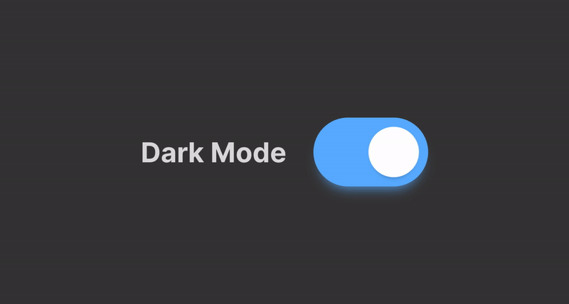

<link rel="stylesheet" href="./readme_assets/style.css">

# Criando um botão estilo Switch, para brincar!

Com esse botão vamos aprender e testar na prática, como a maioria dos sliders (swtiches) de modo nuturno funcionam.

## Neste arquivo você encontra:

1. [como vai funcionar a estrutura básica do HTML5](#organizando-o-html5)
2. [Como fazer todo o CSS]()
3. [Alguns métodos bastante interessantes do JavaScript]()

Os Toogle Switches, Switches ou Sliders, na verdade não é um elemento do HTML, eles são uma forma organizada que 
como utilizar um `<input type="checkbox"/>`<input type="checkbox"/> ou `<input type="radio"/>`<input type="radio"/>. (Você pode clickar neste checkbox e no radio). Eles tem a premissa de significar marcardo/desmarcado, ligado/desligado, claro/escuro, mas acaba que eles não tem nenhum apelo visual e nem uma usabilidade tão boa. Pensando nisso, foram desenvolvidos esses tipos de botões, que são constantemente utilizados no iphone e android, possuem um visual mais bonito e são bem mais indicativos, facilitando até mesmo o uso. o "Switch" é apenas a customização de um checkbox, ou de um radio.

 ## Vamos aprender a criar e customizar

 ### Organizando o HTML5

 Vamos criar um `checkbox`:

        <body>
            <label class="switch">
                <input type="checkbox"/>
                
            </label>
        </body>

ONDE: dentro do `<body>  </body>` criamos uma label para poder utilizar o checkbox
o `label` vai servir de legenda para adicionar o `input` do checkbox e o `span` com o nosso visual, que iremos fazer no CSS. 

nosso HTML está pronto. Literalemente este é o código que vamos por dentro da nossa estrutura principal.

